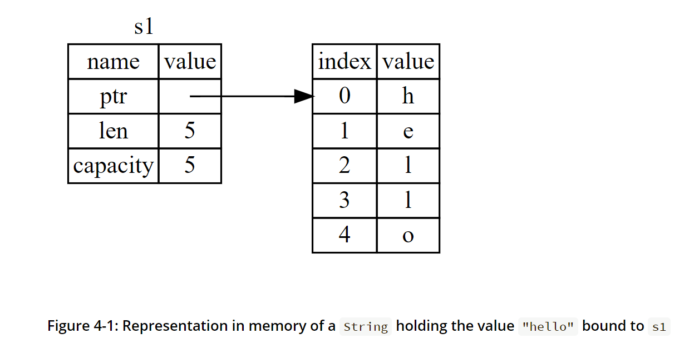
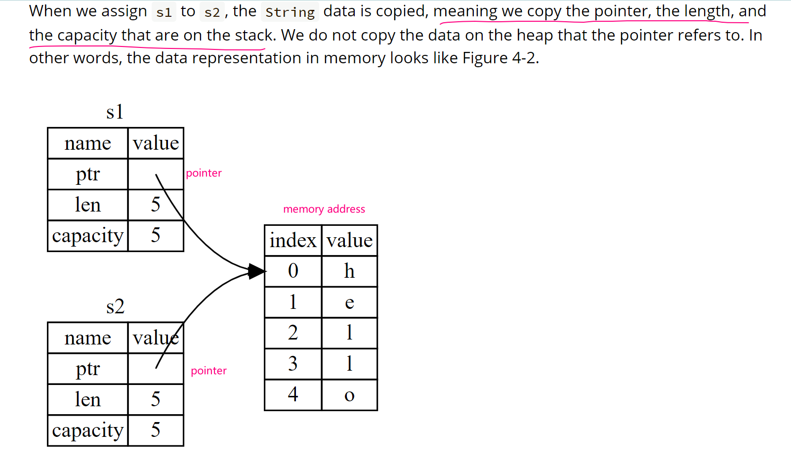
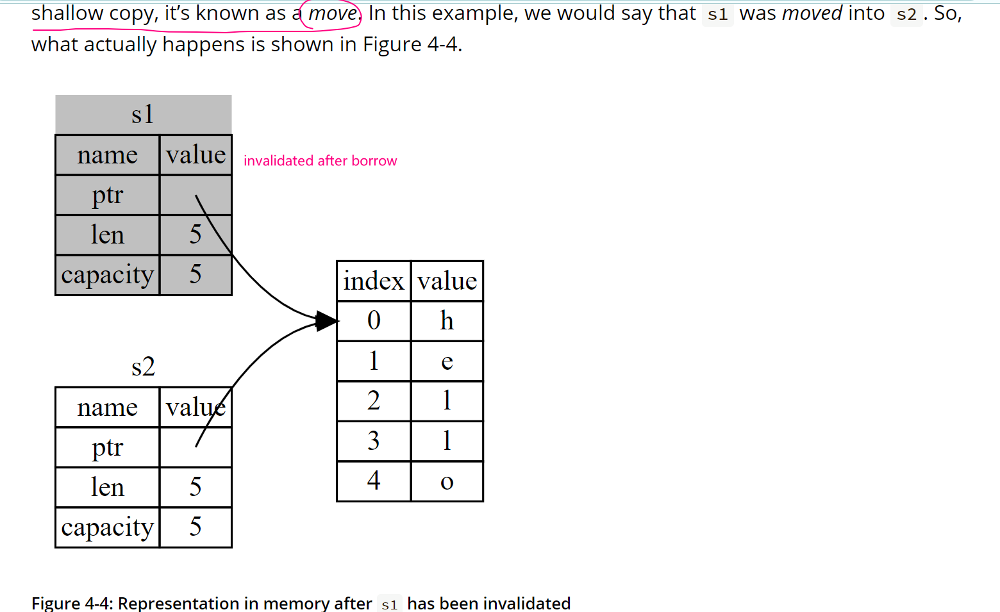
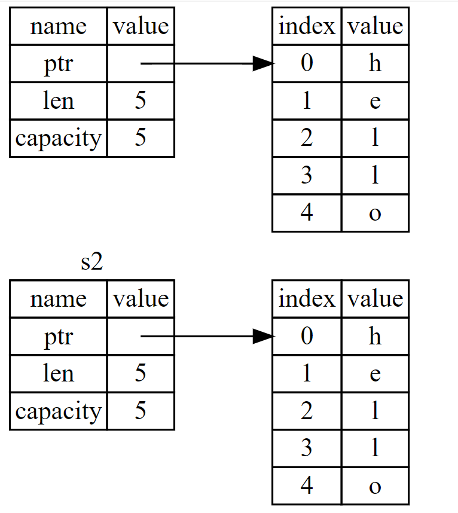
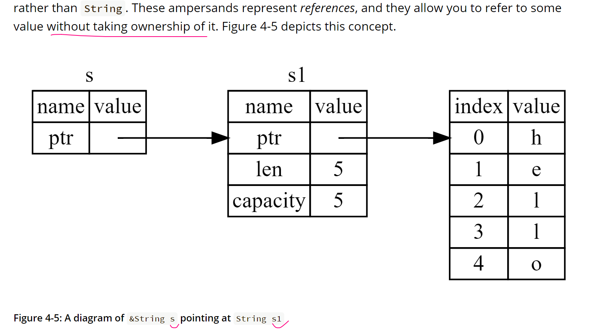

# 根据英文文档学习 rust

## 2. 猜字游戏

源码 demos/guessing_name

什么是 prelude ？

By default, Rust has a set of items defined in the standard library that it brings into the scope of every program. This set is called the prelude, and you can see everything in it in the standard library documentation.

prelude 就是一个标准库

比如 `use std::io;` 就是使用标准库

`&` 表示这是一个 reference

`Result` is an enumeration, enum 枚举，枚举的每个可能的值叫做 variant。Result 枚举的值可能是 Ok 或者 Err， Err 需要写 handler

`crate` 是 rust 源码文件的集合，rust 标准库暂时没有提供 random 函数。

猜字游戏是一个 binary crate，也就是可执行文件。`rand` crate 是一个 library crate，它提供了其他程序可能需要的代码，但是无法被单独执行。

也就是 rust 程序分为两种

- library crate
- binary crate，可单独执行

.toml 的依赖也遵循 semantic version 语义化版本

`rand="0.8.5"` 等同于 `rand="^0.8.5"`，代表任何 >= 0.8.5 并且 < 0.9.0 的版本

依赖的 registry 是 Crates.io ，从这里下载项目依赖

cargo build 会

- 检查依赖有没有下载，只会下载一次然后 build 依赖
- 如果源码有修改，只 build 你的源码，而不会再 build 依赖

.lock 文件会记录依赖的具体版本，而不会像 npm 一样默默升级。
因此，除非手动更改版本，依赖的版本不会自动升级。确保每次有 reproducible builds.

cargo update 用来升级依赖，但是还是会遵循语义化版本的原则

没有用到的变量要用 `_` 开头标识，否则编译会报错

A `match` expression is made up of **arms**. An `arm` consists of a **pattern** to match against, and the code that should be run if the value given to `match` fits that arm’s pattern

### 总结

介绍了 `let` `mut`, `match`, `loop` 和依赖 rand 的安装

`&` 表示引用类型

`Result` 有两种返回值类型，`Ok` 和 `Err`

match 里面写可能得情况处理用 `,` 不用 `;`

## 3. common programming concepts 共同的编程概念

### variables 变量

变量默认是不可变的 immutable. once a value is bound to a name, you can't change that value;

constants 常量，不可使用 `mut` 修饰，始终都是不可变的，约定全大小，用 \_ 连接。比如 `const THREE_HOURS_IN_SECONDS = 60 * 60 * 3`

变量的 shadow

### basic types 基本类型

`scalar` 表示单一值的数据类型，包括整型 `integer`，浮点数`floating-point-number`, 布尔值`boolean`, 字符型（不是字符串）`character`

an integer is a number without a fractional component. 没有小数点部分的数字称为整型，默认的整型是 `i32`

signed integer 有符号的整型，包含 i8 i16 i32 i64 i128 `isize`

unsigned integer 无符号的整型，包含 u8 u16 u64 u128 `usize`

用 `''` 声明的是字符，用 `""` 声明的是字符串，rust 支持 utf-8

`compound` 类型表示复合类型，rust 有两种基础复合类型，`tuple` 和 `array`

tuple 一旦声明，大小无法改变 `let tup:(i32, f64, u8) = (500, 6.4, 1);`

tuple 的解构 `let (x, y, z) = tup;`

`array` 的长度也无法更改，需要长度可变应该用 `vector`

数组的声明方式

- `let a:[i32; 5] = [1,2,3,4,5];`
- `let a = [3; 5];`

### functions 函数

expression 表达式不能句末有 `;`

statement 语句句末总是有 `;`

语句没有返回值，表达式有返回值。表达式句末加 ; 变成语句。

一个块级代码的返回值就是最后一个 expression 计算的值

### comments 注释

// 表示注释

### control flow 控制流程

if 的参数就是严格的 bool 不会做自动类型转换

if/else if/else if/else 只会运行第一个条件为 true 的分支，其他的都不会运行

如果有很多个条件分支，应该使用 `match` 优化

### loops 循环

带标签的 loop 的标签只能是单引号开始，比如 ``outer_loop: loop { ..省略.. }`;

推荐用 for in 来遍历数组而不是用 自增的 index 和 while 循环，因为：

- while 更慢
- rust 需要添加额外代码来检测 runtime 时 index 是否越界

需要使用的时候可以考虑用 `Range`

## 4. 所有权 ownership

所有权是 rust 内容安全策略的保证，也是无需做垃圾回收的原因。所有权就是一系列用来规范 rust 程序管理内存使用的准则。

有些程序自带垃圾回收，会定时清理没有使用的内存，也就是说程序员必须显式的分配和回收内存。

rust 走了一个新的路子，根据所有权规范，在编译期间自动检查内容使用，任何检查通不过，都无法编译程序。

前置知识：程序数据的存储，堆还是栈？heap or stack [这篇总结](https://doc.rust-lang.org/stable/book/ch04-01-what-is-ownership.html)讲的很好，简单易懂

总的来说：

- stack 上存基础数据类型，不能存复合数据类型
- stack 遵循后进先出原则，存就是压入栈，取就是压出栈，就像叠盘子
- stack 上的数据大小都是已知且确定的
- 数据大小不确定的都是放在 heap 上
- heap 上放数据的过程就是分配内存的过程，首先找到一个足够大的内存空间，然后返回内存地址 pointer，这个过程就是 allocating
- 为什么 heap 比 stack 更慢一点？1. 要先找到一片足够大的内存空间放东西 2. bookkeeping 记账为了下个 allocation（标记哪些内存是空的，哪些不可用） 3. 在 1 的基础上找具体的内容（比如对象的某个 nth 属性），也需要查找内存地址

ownership 规则

- Each value in Rust has an owner. 每个值都有一个 owner
- There can only be one owner at a time. 每次只有一次 owner
- When the owner goes out of scope, the value will be dropped. 当 owner 离开了作用域，这些值都会被丢弃

A scope is the range within a program for which an item is valid. 作用域就是在程序的某个范围内一个值是有效的。

```rust
   {                      // s is not valid here, it’s not yet declared
        let s = "hello";   // s is valid from this point forward

        // do stuff with s
    }                      // this scope is now over, and s is no longer valid
```

- When s comes into scope, it is valid.
- It remains valid until it goes out of scope.


`String` 和 string literals 字面量区别
- 前者分配在 heap 上，可变
- 后者不可变

string 字面量在编译时从硬编码直接转成可执行文件。

关于内存分配和垃圾回收：有的语言需要自己做垃圾回收，一次分配一次回收配对，比如C；有的语言 runtime 自带垃圾回收，会检测内存使用，定时清理内存，比如Java；Rust另辟蹊径，走的路是"the memory is automatically returned once the variable that owns it goes out of scope."，当变量走出了它的作用域，会自动失效并回收内存。

```rust
{
        let s = String::from("hello"); // s is valid from this point forward

        // do stuff with s
    }                                  // this scope is now over, and s is no
                                       // longer valid
```

rust 会自动调用 `drop` 方法

shallow copy/deep copy 浅拷贝/深拷贝

rust 没有浅拷贝，而是 move （移动）

当 s2 = s1; s1 就失效了，之后再次引用 s1 是不被允许的。


为什么会有 move 这个概念？因为

`let s1 = String::from("hello")` 在 heap 上分配内存，存这个 string 的内容，返回一个 pointer 给 s1




`let s2 = s1;` 是拷贝了一份 pointer 同样的指向相同的堆上的内存地址



根据 rust 如果变量离开了作用域就会自动失效并释放内存的原则，现在有 s1/s2 两个同时指向一个内存地址，就会释放2次 `a double free error`，这样是不对的。因此 rust 认为 s1 失效了，这是一个新的概念，move，失效的 s1 不用再离开作用域之后回收内存了，只有s2会，这样就解决了 double free 问题



没有浅拷贝，那深拷贝呢？在 rust 里有提供 `clone` 方法

```rust
    let s1 = String::from("hello");
    let s2 = s1.clone();

    println!("s1 = {}, s2 = {}", s1, s2);
```

现在的内存图是这样



有 `Drop` trait 的不能实现 `Copy`，有 `Copy` 的就不会认为是 move 而是直接完全复制。通常来说基本类型，包含所有的数字，字符（不是字符串），bool，以及只包含基本类型的 tuple 可以被完全复制。

给 function 传参会转移 ownership 所有权，参数会实行 move 或者 copy 操作，取决于参数的类型

return 返回值也会传递 ownership 所有权

如果每次调用 function 都要转移参数的所有权，然后返回值又交回来一个新的，那这样不是很烦吗？

```rust
fn main() {
    let s1 = String::from("Hello");

    let s2 = take_and_return_ownership(s1); // 传递 s1 然后又返回这个值
}

fn take_and_return_ownership(s: String) -> String {
    // do something here
    s  // return this param as value
}
```

如果只是想调用 function 传参但是不想转移所有权呢？使用 `references`

引用通过 `&` 标记，当一个函数接受引用作为参数时，引用参数的内存图是这样的



创建引用称为 borrowing，借用。函数无法修改借用的值，引用默认也是不可变的，就像变量自身一样。

可以修改的引用没有吗？有的！mutable references

在相同的 scope 内，不能同时存在两个相同的，指向同一个值的可变 reference。为啥？因为两个引用都存在，那么就有2个地方都可以对原始值发起修改，同一时刻！而且没有加锁！也就是会发生 `data race`。

什么是 `data race`？

- 同一时刻有两个指针指向同一个数据
- 至少有一个指针可以用来写数据
- 没有锁机制来保护数据的读写

可变和不可变引用不能同时存在

引用的作用域存在于
- 开始生成
- 最后一次被使用的范围之间

```rust
    let mut s = String::from("hello");

    let r1 = &s; // no problem
    let r2 = &s; // no problem
    println!("{} and {}", r1, r2);
    // variables r1 and r2 will not be used after this point

    let r3 = &mut s; // no problem
    println!("{}", r3);

```

`dangling pointer` 悬空/迷途/悬挂指针

总结关于引用的规则
- At any given time, you can have either one mutable reference or any number of immutable references. 任何时刻，要么有1个可变引用，要么多个不可变引用
- References must always be valid. 具体情况具体解释，重点是 valid

特殊的引用 string slice 的类型是 `&str`  `&s[startIndex..endIndex]` 这个下标必须要是一个合法的 UTF-8 字符串的边界，不能是切割一个完整的 multibyte character。在 UTF-8 中，中文汉字大部分都是3个字节组成的 unicode 编码，因此中文是 multibyte character.

string 的 `len()` 是字节的长度，不是字的长度。比如 `Hello` 的长度是5，因为每个英文字母都是1个字节够存，`中`的长度是3，表示这个3个字节长。
记住 rust 用的是 UTF-8 编码格式，一个世界字符（英文中文韩文emoji）所代表的 unicode 编码，长度是不一样的，范围是 1-4 个字节。

### struct

struct 的 instance 整体属性都是可变的，rust 不允许声明某些可变，其他不可变。

支持属性的 shorthand 缩写，以及 `..` 展开运算（注意不是`...`，和 js 不一样）

tuple struct 元组结构体，只有类型，没有属性名

unit-like struct 没有任何属性的结构体

accessing fields of a borrowed struct instance does not move the field values, which is why you often see borrows of structs
使用借用的结构体实例的属性时，不会发生移动，因此结构体实例的借用非常常见

用 Debug 宏命令查看结构体的内容

`dbg!` 宏指令 takes ownership，而 `println!` 是借用

automatic referencing and dereferencing. 自动引用转换，在结构体的函数属性中体现。
比如 `p1.distance(&p2);` 和 `(&p1).distance(&p2);` 是相等的。 通过函数的定义，rust 可以自动转换函数接受的 self 参数类型，包括
- `&self` reading self （只读，借用）
- `&mut self` mutating self （可改变，写操作）
- `self` consuming self （移动，拿取所有权）

结构体的函数叫做 associated functions 关联函数。有的会用到 self(实例)，有的不需要用到（类比 js 的 static，没有 this）


