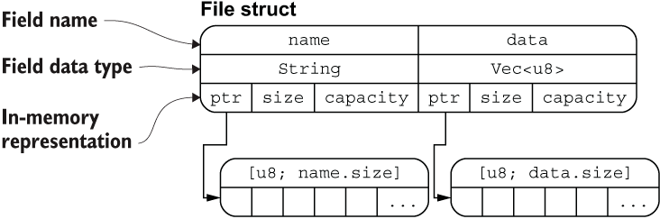

## rust 资源

- rust 英文官网 https://doc.rust-lang.org/stable/book/
- rust 标准库 https://doc.rust-lang.org/std/
- prelude 标准库 https://doc.rust-lang.org/stable/std/prelude/index.html
- rust 中文圣经 https://course.rs/about-book.html
- rust 语言中文社区 https://rustcc.cn/
- rusty book 锈书 https://rusty.course.rs/

## 记录

- 第一天

### 安装环境 

- 安装 rust，使用 wsl 安装的 ubuntu 系统

    `$ curl --proto '=https' --tlsv1.2 https://sh.rustup.rs -sSf | sh`

    检测是否安装成功

    `rustc -V` 或者 `rustc --version`

    `cargo -V` 或者 `cargo --version`

- 安装 gcc toolchain

`sudo apt-get install build-essential`

- 安装 vscode 插件
    - rust-analyzer
    - even better toml
    - error lens

### 创建 hello-world

Rust 项目主要分为两个类型：bin 和 lib，前者是一个可运行的项目，后者是一个依赖库项目。

cargo new hello-world

cargo run 运行

target 目录下分为 debug 和 release 两个文件夹

cargo check: 快速检测代码是否能编译通过

cargo.toml 类似 package.json

cargo.lock 类似 package.json 的 lock 文件

什么情况下该把 Cargo.lock 上传到 git 仓库里？很简单，当你的项目是一个可运行的程序时，就上传 Cargo.lock，如果是一个依赖库项目，那么请把它添加到 .gitignore 中

### 修改镜像 registry

### 基本概念

字符串类型比较
- `&str` 是不可变的， `String` 是可变的
- `&str` 是硬编码可执行文件，因此是不可变的
- `String` 是 utf-8 编码字符串

Rust 中的字符是 Unicode 类型，因此每个字符占据 4 个字节内存空间，但是在字符串中不一样，字符串是 UTF-8 编码，也就是字符串中的字符所占的字节数是变化的(1 - 4个字节)

#### 啥是字节和比特？

一个比特(bit) = 1 bit = 1b = 二进制中的一个数位，即 0 或者 1

一个字节(byte) = 1B = 8 bit

一个千字节(KB) = 1KB = 1024B = 1024 * 8b

#### Unicode 和 utf-8 的区别

计算机只能理解二进制的 01，而人类语言比如英语转成二进制需要有一个映射，这个映射就叫做字符集。

最开始的字符集是 ACSII，American Standard Code for Information Interchange（美国信息交换标准代码），因为计算机是美国人发明的。这个字符集映射规定，字母 `A` 对应的字符编码是 `65`，转成二进制是 `0100 0001`。

既然英文有字符集，其他语言比如中文韩文日文都会有对应的映射字符集，为了统一标准编码，诞生了 unicode 字符集，这个集合（理论上）包含了世界上所有的文字和符号，统一编码，用来解决乱码问题。

unicode 只是一个规定编码的准则，比如编号为`65`的字符对应`A`，编号为`40657`对应中文的`黑`，虽然都是一个字，
但是转成二进制一个是`0100 0001`，一个是 `0100 1111 0110 10001`，很明显后者需要更多字节空间才能存储。

所以怎么存储 unicode 字符成了一个问题？如果统一每个字符都用4个字节来存，也就是32位，这样就能涵盖现有 Unicode 包含的所有字符，这种编码方式叫做 utf-32，它的缺点很明显，巨大的空间浪费。比如 `A` 只需要一个字节（8位）就够存了，因此浪费了3个字节的空间空着。

因此，通常更流行的编码方式是 utf-8，utf-8 代表 8 位一组表示 Unicode 字符的格式，使用 1 - 4 个字节来表示字符，也就是说，根据 unicode 编码的顺序，划分了4个范围，从小到大占据的字节长度逐渐增加，这样就能既省空间又能涵盖所有的字符。

- U+ 0000 ~ U+ 007F: 0XXXXXXX  // 1个字节
- U+ 0080 ~ U+ 07FF: 110XXXXX 10XXXXXX // 2个字节
- U+ 0800 ~ U+ FFFF: 1110XXXX 10XXXXXX 10XXXXXX // 3个字节
- U+10000 ~ U+1FFFF: 11110XXX 10XXXXXX 10XXXXXX 10XXXXXX // 4个字节

根据开始不同的标志位，实现了变长存储字符。

## 结构体

结构体的 `..` 要放在最后一行。

结构体声明的属性遵从所有权原则，比如 String 会发生所有权的转移，而 bool 和 i32 不会，因为它们都实现了 `Copy` 特征。

根据结构体的内存图也可以证明这个原则。

当结构体某个字段的所有权发生了转移以后，无法再继续访问该字段，但是不影响其他正常字段的访问。

为什么无法用 `println` 打印结构体？

因为需要实现了 `Display` 特征才能被 `println` 打印，结构体没有实现这个玩意儿。（为什么不实现？因为打印
结构体数据结构可能会考虑很多要素。你想要逗号对字段进行分割吗？需要括号吗？加在什么地方？所有的字段都应该显示？类似的还有很多，由于这种复杂性，rust 编译器没有实现，而是交个用户自己实现。）

所以我们用 `Debug` 特征来打印结构体。

可以手动实现，也可以通过 `derive` 派生实现。
在结构体上方添加 `#[derive(Debug)]`，配合占位符 `{:?}` 就能愉快的使用 `println` 打印结构体了。

当结构体较大时，我们可能希望能够有更好的输出表现，此时可以使用 `{:#?}` 来替代 `{:?}`

除此之外，还可以用宏指令 `dbg!` 来打印结构体。

`dbg!` 宏指令 takes ownership，而 `println!` 是借用，`dbg!` 最终会把表达值的所有权返回。`dbg!` 输出到 `stderr`而 `println!` 输出到 `stdout`

## 枚举 

`prelude` 属于 Rust 标准库，Rust 会将最常用的类型、函数等提前引入其中，省得用户再手动引入。
